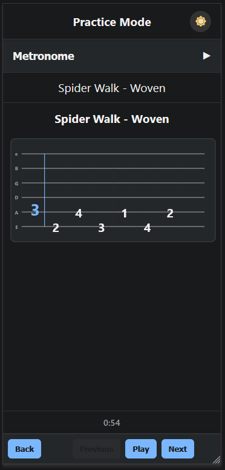
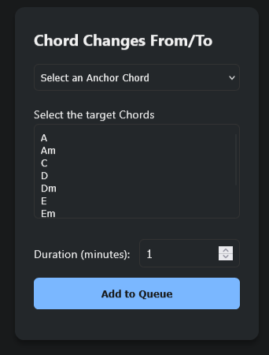
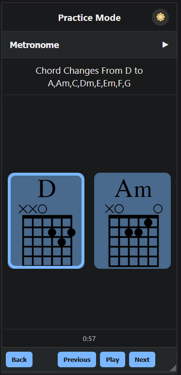
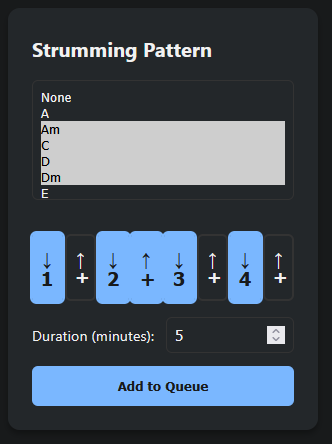
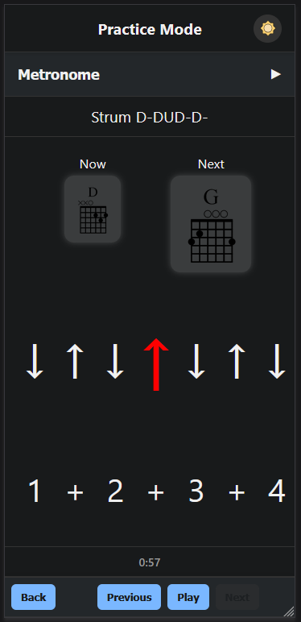

# Beginner's Guitar Practice

A dynamic, interactive tool designed to help beginners develop and improve their guitar playing techniques through structured exercises.

## 🎸 Overview

This application was created as a personal practice aid and is now available to help other guitar enthusiasts in their learning journey. It focuses on three fundamental aspects of guitar playing:
- Spider Walk exercises for finger dexterity
- Chord change practice
- Strumming pattern exercises

## ✨ Features

### 1. Spider Walk Practice

- Multiple walking patterns available
- Helps develop:
  - Finger dexterity
  - Finger independence
  - Speed and accuracy in finger picking
- Visual guidance for each exercise

### 2. Chord Changes Practice

Available in two modes:

#### From/To Practice
- Select one base chord and multiple target chords
- Practice transitions from your base chord to each target
- Example sequence: A → C → A → D → A → Am → A → E
- Perfect for focusing on specific chord transition challenges

#### Random Practice
- Select multiple target chords
- System generates random chord sequences
- Keeps you on your toes and prevents anticipation
- Great for real-world playing preparation

### 3. Strumming Patterns

- Customizable strumming patterns (e.g., DDUDUD, DUDDU, DDDD, UUUU)
- Multiple chord selection
- Visual guidance for each strum
- Combine different chords with various strumming patterns

## ⚙️ Features Common to All Exercises

- Configurable duration for each exercise
- Built-in metronome with adjustable speed
- Optional metronome sound
- Visual beat indicators
- Multiple exercise configurations can be queued
- Dynamic visual guidance synchronized with metronome beats

## 🎯 How to Use

1. Choose your exercise type (Spider Walk, Chord Changes, or Strumming)
2. Configure your exercise parameters
3. Set your preferred duration
4. Adjust metronome speed as needed
5. Start practicing!

You can add multiple exercises to your practice queue, each with its own unique configuration.

## 📝 License

"Beginner's Guitar Practice" is licensed under AGPL-3.0 with Commons Clause.
- Free for non-commercial use
- Modifications and sharing allowed with attribution
- See [LICENSE](LICENSE) for full details

## 👤 Author

Created by [reinaldo558](https://github.com/reinaldo558)

---
*Happy practicing! 🎸*
